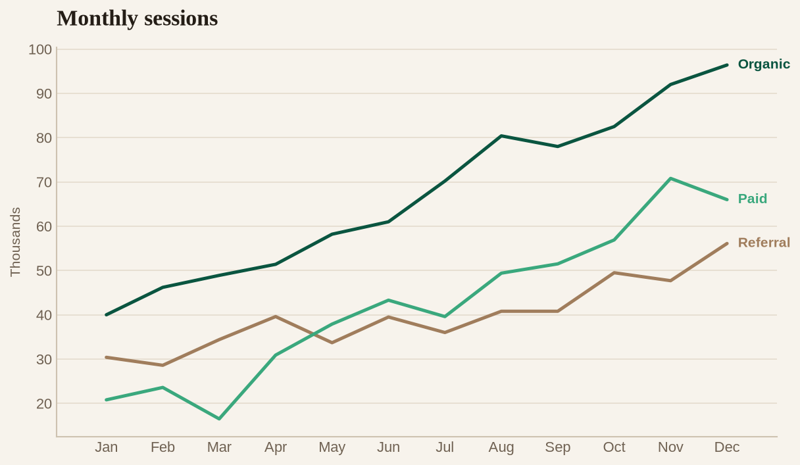
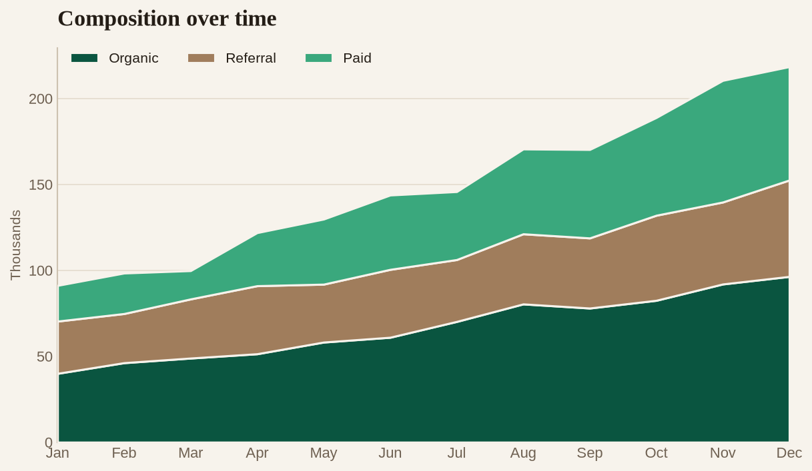
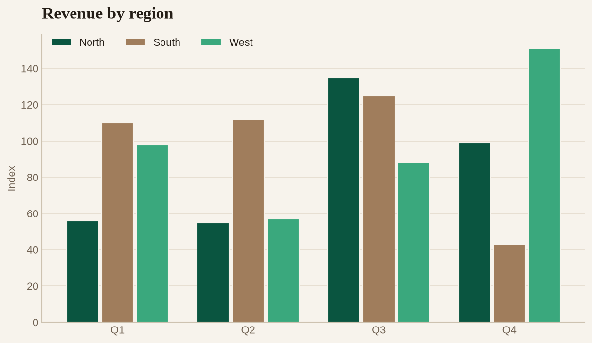
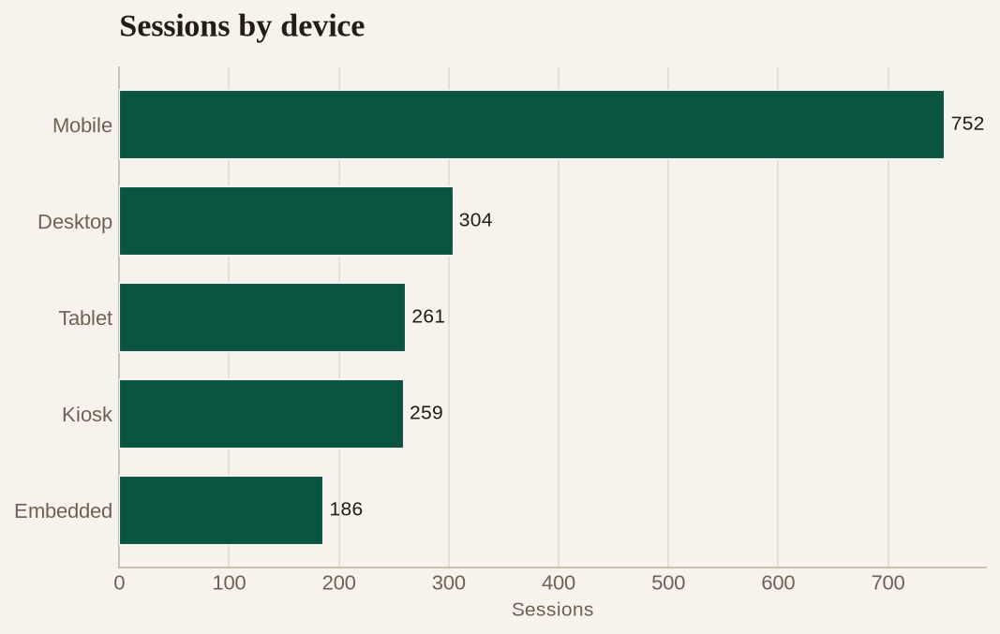
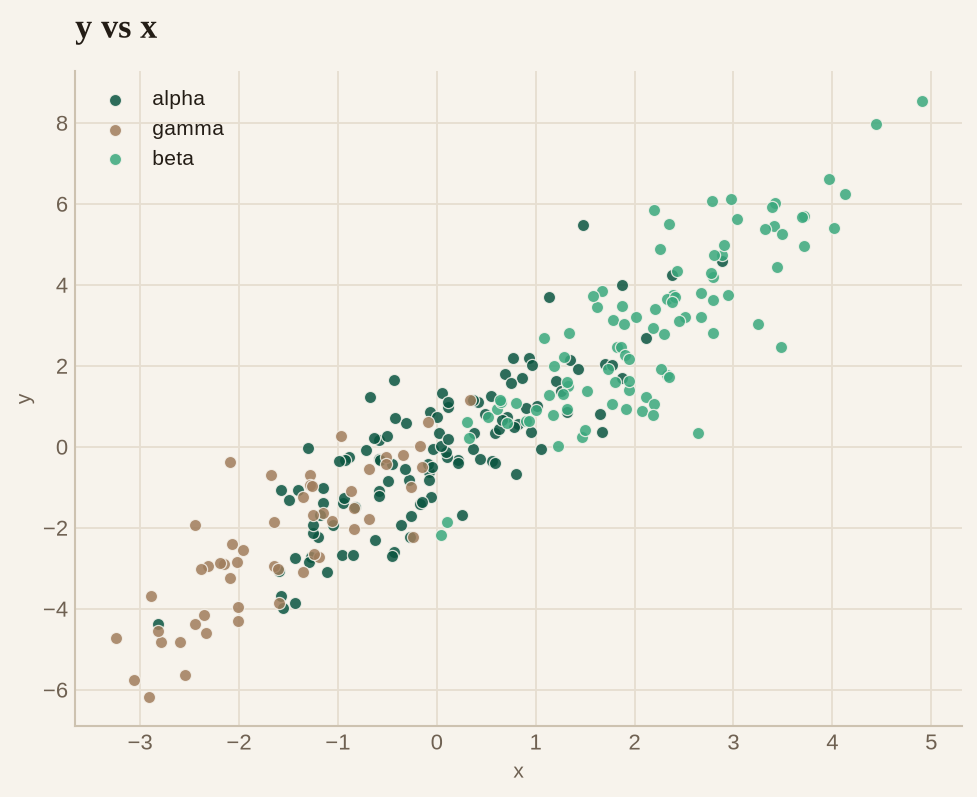
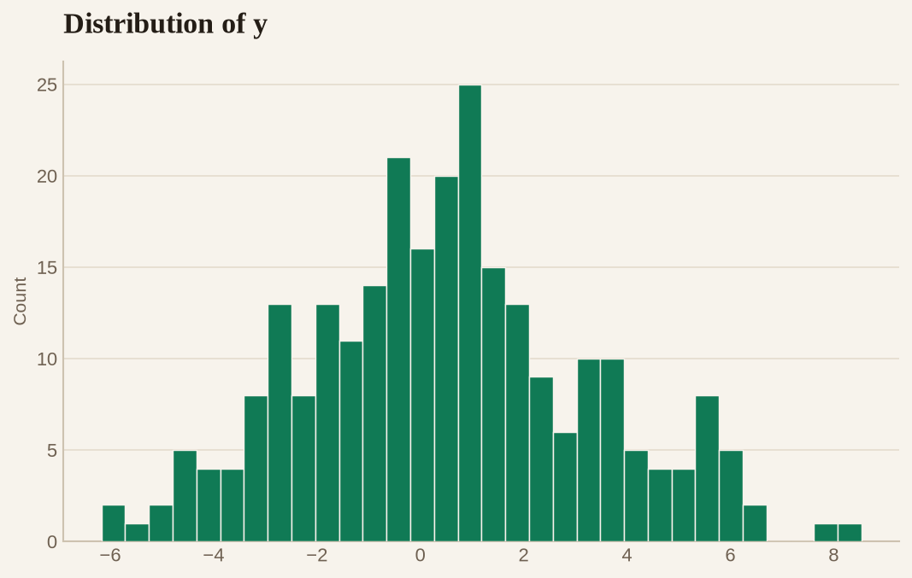
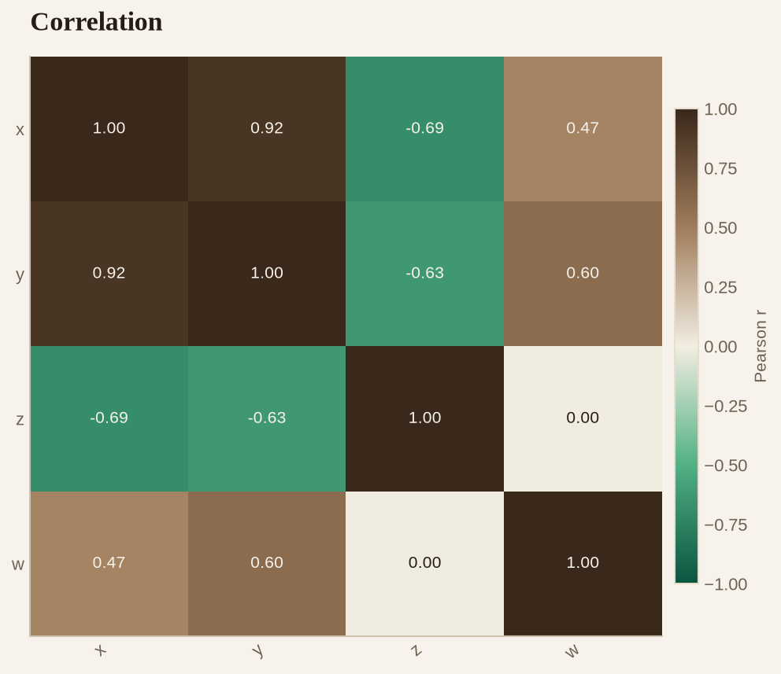
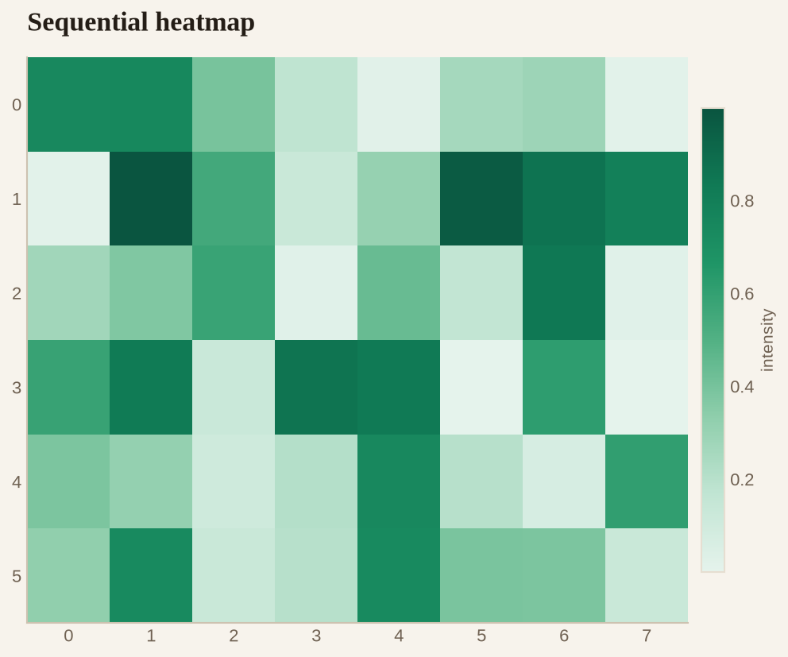
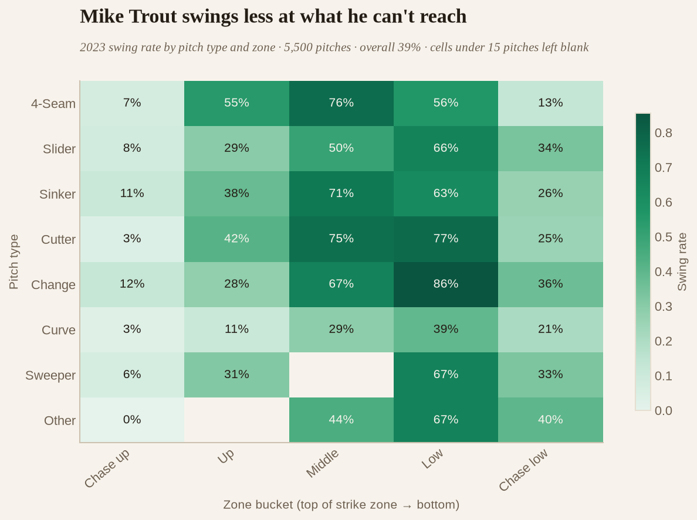

# plumage

A compact **matplotlib** data-visualization library with an editorial look and
a considered color system: **emerald** is the primary hue family and
**espresso** is the secondary. Emeralds carry the headline series, the lead
categorical slot, and the default sequential ramp; espressos carry the
supporting series, the alternate ramp, and the warm pole of an emerald↔espresso
diverging map. Everything sits on warm paper, with **serif titles** over a
clean sans for data labels. Every chart is drawn with matplotlib only — no
seaborn or other backends.

The whole visualization library is a single ~200-line module
(`src/plumage/__init__.py`); the palette and type choices live at the top so
the entire look retunes from one place.


## Project layout

The repository follows the [Cookiecutter Data Science][ccds] conventions:

```
├── data/              # raw, interim, processed, external
├── notebooks/         # exploration only
├── src/plumage/       # the importable library
├── models/            # trained artifacts
├── reports/figures/   # generated graphics for write-ups
├── docs/              # mkdocs site
└── pyproject.toml     # project metadata
```

[ccds]: https://cookiecutter-data-science.drivendata.org/

## Install

```bash
pip install -e .          # or: pip install -r requirements.txt
```

## Quick start

```python
import plumage as pl

pl.use_theme()            # apply the global matplotlib theme once

df = pl.datasets.monthly_channels()
ax = pl.line(df.index, {c: df[c] for c in df.columns},
             title="Monthly sessions", ylabel="Thousands")
ax.figure.savefig("reports/figures/line.png")
```

Regenerate every figure below with:

```bash
python -m plumage.gallery
```

## Gallery

| | |
|---|---|
|  |  |
|  |  |
|  |  |
|  |  |

## API

Everything is exported from the top-level `plumage` package.

**Theme & color**

| Name | Description |
| --- | --- |
| `use_theme(base=10.5)` | Apply the plumage look globally via `rcParams` (serif titles, sans labels, warm paper). |
| `register_colormaps()` | Register `plumage_emerald` / `_espresso` / `_diverging` (+ `_r`) with matplotlib. |
| `categorical(n=None)` | The 8-slot categorical palette, or its first `n` slots. |
| `sequential(n, family="emerald")` | `n` evenly spaced colors from the emerald or espresso ramp. |
| `shade(color, amount)` | Lighten (`>0`) or darken (`<0`) a hex color. |

Color constants: `EMERALD`, `ESPRESSO` (100–700 step dicts), `PRIMARY`,
`SECONDARY`, `CATEGORICAL`, `CATEGORICAL_NAMES`, `INK`, `INK_SOFT`, `SURFACE`,
`GRID`, `AXIS`, and the `*_CMAP` colormaps.

**Charts** — each returns the matplotlib `Axes`:

| Name | Description |
| --- | --- |
| `bar(labels, values, …)` | Single-series bar chart (nominal bars share one hue). |
| `grouped_bar(labels, series, …)` | Clustered bars, one color per named series. |
| `line(x, series, …)` | Line chart with optional direct end-labels. |
| `area(x, series, stacked=True, …)` | Stacked or overlaid area chart. |
| `scatter(x, y, groups=None, …)` | Scatter, optionally colored by a categorical array. |
| `histogram(values, bins=30, …)` | Single-series histogram in the primary emerald. |
| `heatmap(matrix, diverging=False, …)` | Heatmap for an array/DataFrame; `diverging` centers on zero. |
| `correlation(df, …)` | Diverging emerald↔espresso correlation map. |

Sample data for demos lives in `plumage.datasets`; the palette card and figure
gallery live in `plumage.gallery`.

## Worked example — Mike Trout's 2023 swing rate

`reports/trout_swing_rate.py` runs the library on a real Statcast dataset (one
row per pitch Mike Trout saw in 2023) and renders his swing rate in each
**pitch type × zone bucket** as a sequential-emerald heatmap — a natural fit,
since swing rate is a 0–1 magnitude. Statcast zones are grouped into five
vertical buckets (the in-zone up/middle/low rows plus the chase quadrants), and
cells with fewer than 15 pitches are left blank.

```bash
# raw data stays out of git (see .gitignore); pass its path or drop it in data/raw/
python reports/trout_swing_rate.py path/to/trout_2023.csv
```



Trout rarely offers at pitches up out of the zone (3–12%) and attacks the
middle and lower thirds hard (50–86%). The tidy numbers land in
`reports/trout_swing_rate_summary.csv`.

## Design notes

- **Editorial by default.** Warm paper surface, a serif headline over a clean
  sans for data labels, recessive chrome, and generous spacing — tuned to be
  aesthetically pleasing and quick to read.
- **Color follows identity, in fixed order.** Categorical hues are assigned
  slot 1..N and never cycled; a 9th series should fold into "Other" or become
  small multiples (`categorical(9)` raises rather than invent a hue).
- **Emerald leads, espresso supports.** Neighbouring categorical slots come
  from different hue families so adjacent series stay easy to tell apart.
- **Diverging = two hues + a neutral midpoint.** The emerald↔espresso map meets
  at a warm cream that reads as "nothing," so zero never looks like a value.
- **Recessive chrome.** No top/right spines, a single soft y-grid behind the
  data, muted axis ink, thin marks, and selective direct labels instead of a
  number on every point.

## License

MIT
