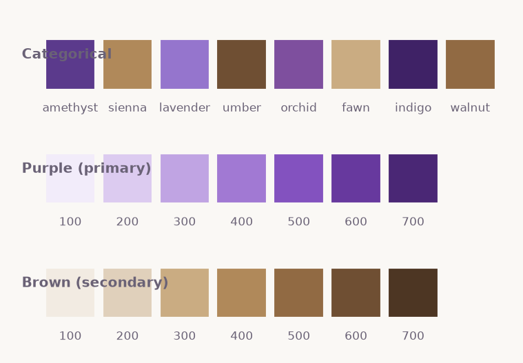

# plumage

A compact matplotlib data-visualization library with a purple-led,
muted-brown palette. Purples carry the headline series and the default
sequential ramp; browns carry the supporting series and the warm pole of the
purple↔brown diverging map. Everything is drawn with matplotlib only.



## Install

```bash
pip install -e .
```

## Quick start

```python
import plumage as pl

pl.use_theme()                       # apply the global theme once
df = pl.datasets.monthly_channels()
pl.line(df.index, {c: df[c] for c in df.columns},
        title="Monthly sessions", ylabel="Thousands")
```

## Charts

Each helper returns the matplotlib `Axes`, so results compose with the rest of
matplotlib.

- `bar`, `grouped_bar` — categorical magnitude
- `line`, `area` — change over time
- `scatter` — relationship between two measures
- `histogram` — a single distribution
- `heatmap`, `correlation` — a matrix (sequential or diverging)

Regenerate the full gallery into `reports/figures/`:

```bash
python -m plumage.gallery
```

See [Palette](palette.md) for the color system and the house rules that keep
charts readable.
